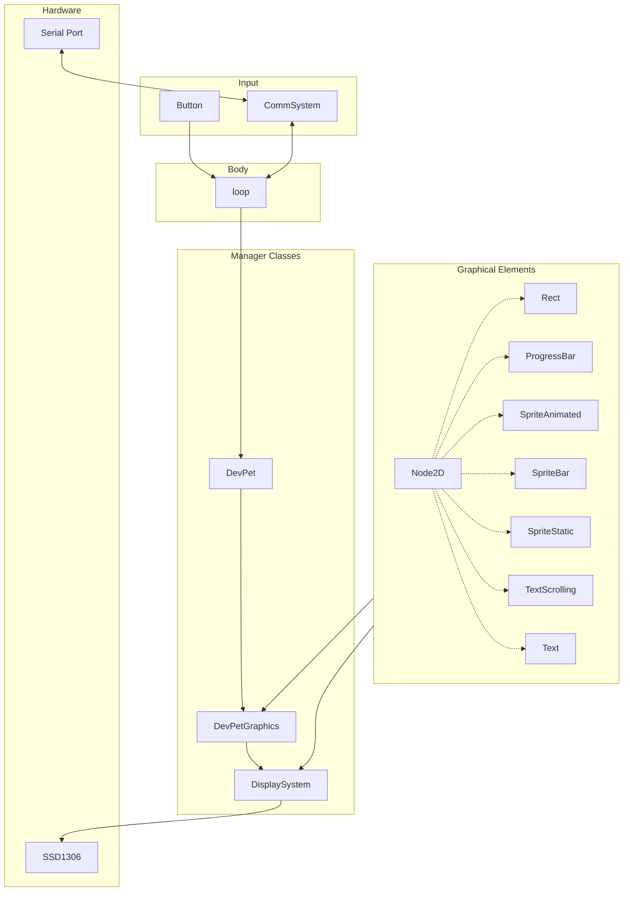

<!--
SPDX-FileCopyrightText: 2024 AFCMS <afcm.contact@gmail.com>
SPDX-License-Identifier: GPL-3.0-or-later
-->

# DevPet

[](https://github.com/AFCMS/devpet/actions/workflows/platformio.yml)

## Design



## Run the project

### Install PlatformIO

The project depends on the [PlatformIO](https://platformio.org) toolkit.

You can either install the [VSCode extension](https://platformio.org/install/ide?install=vscode) or the [CLI](https://platformio.org/install/cli)

### Build

```shell
platformio run
```

### Upload on the ESP32

Make sure the ESP32 is connected to the computer and the USB port is accessible.

```shell
platformio run --target upload
```
